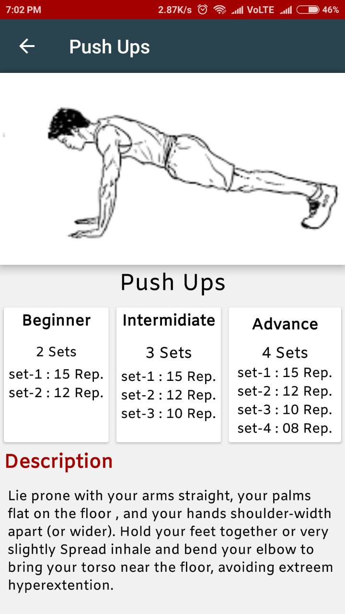

# Gym Buddy

### What is Gym Buddy
This application is developed under Developer Student Club leading by [Akshay Nandwana](https://github.com/anandwana001) and developed by Mohit Chug. We have seen a problem facing by a local Gym trainer where he is not able to manage 40 to 50 people, as he is the only trainer in the gym. We decided to develop a mobile solution where every person who is coming to gym can do all their exercises and other actvities given in application in proper way. We are including other features in application like utilities containing BMI and Water calculator, Diet Plans, Protien catalogue and also details about competitions like WeightLifting, PowerLifting, StrengthLifting and BodyBuilding.

### Screenshots

   

   

 
    

    

 

